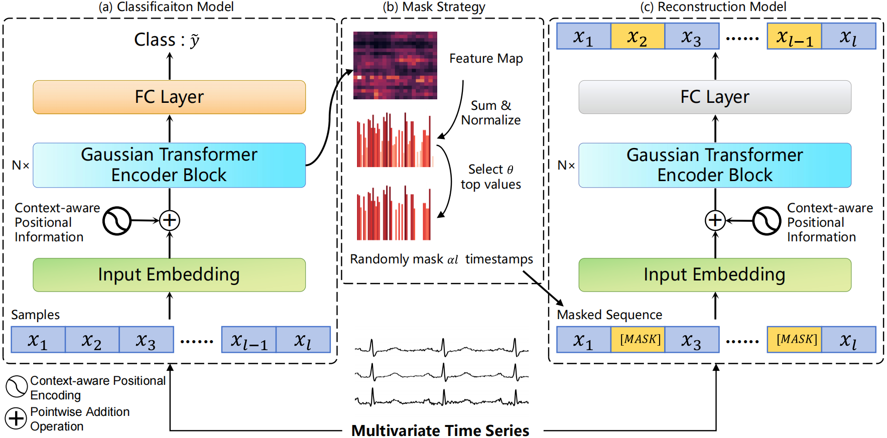

# Multivariate Time Series Classification with Crucial Timestamps Guidance

Our complete code will be made public after the paper is received.

## 💬 Introduction

This is CTNet model, the PyTorch source code of the paper "Multivariate Time Series Classification with Crucial Timestamps Guidance". Our method is a transformer-based method for Multivariate Time Series Classification. It has achieved the SOTA performance in the MTSC task on UEA archive.

### 📦UEA Dataset

Data is available at [Google Drive](https://drive.google.com/drive/folders/1Y8ZNR6zPZmI74QEv0R4IhYoHOiNiVOTW) .

You can also visit the [official website ](http://www.timeseriesclassification.com/). 

### 📦Statistics of the Result

|                           | TS2Vec      | TNC         | TS-TCC      | TST         | TapNet      | MICOS       | DKN         | Formertime  | FEAT        | CTNet  |
| ------------------------- | ----------- | ----------- | ----------- | ----------- | ----------- | ----------- | ----------- | ----------- | ----------- | ------ |
| ArticularyWordRecognition | 0.987       | 0.973       | 0.953       | 0.977       | 0.987       | 0.99        | 0.993       | 0.984       | 0.991       | 0.987  |
| AtrialFibrillation        | 0.2         | 0.133       | 0.267       | 0.067       | 0.333       | 0.333       | 0.467       | 0.6         | 0.293       | 1      |
| BasicMotions              | 0.975       | 0.975       | 1           | 0.975       | 1           | 1           | 1           | 1           | 1           | 1      |
| CharacterTrajectories     | 0.995       | 0.967       | 0.985       | 0.975       | 0.997       | 0.994       | 0.986       | 0.991       | 0.993       | 0.992  |
| Cricket                   | 0.972       | 0.958       | 0.917       | 1           | 0.958       | 1           | 0.951       | 0.981       | 0.969       | 1      |
| DuckDuckGeese             | 0.68        | 0.46        | 0.38        | 0.62        | 0.575       | 0.74        | 0.56        | 0.6         | 0.564       | 0.76   |
| EigenWorms                | 0.847       | 0.84        | 0.779       | 0.748       | 0.489       | 0.901       | 0.628       | 0.618       | 0.811       | 0.84   |
| Epilepsy                  | 0.964       | 0.957       | 0.957       | 0.949       | 0.971       | 0.971       | 0.979       | 0.964       | 0.948       | 0.964  |
| ERing                     | 0.874       | 0.852       | 0.904       | 0.874       | 0.133       | 0.941       | 0.933       | 0.904       | 0.896       | 0.944  |
| EthanolConcentration      | 0.308       | 0.297       | 0.285       | 0.262       | 0.323       | 0.247       | 0.372       | 0.485       | 0.322       | 0.312  |
| FaceDetection             | 0.501       | 0.536       | 0.544       | 0.534       | 0.556       | 0.523       | 0.631       | 0.687       | 0.53        | 0.646  |
| FingerMovements           | 0.48        | 0.47        | 0.46        | 0.56        | 0.53        | 0.57        | 0.6         | 0.618       | 0.488       | 0.67   |
| HandMovementDirection     | 0.338       | 0.324       | 0.243       | 0.243       | 0.378       | 0.649       | 0.662       | 0.567       | 0.378       | 0.567  |
| Handwriting               | 0.515       | 0.249       | 0.498       | 0.225       | 0.357       | 0.621       | 0.231       | 0.214       | 0.542       | 0.399  |
| Heartbeat                 | 0.683       | 0.746       | 0.751       | 0.746       | 0.751       | 0.766       | 0.765       | 0.761       | 0.746       | 0.766  |
| InsectWingbeat            | 0.466       | 0.469       | 0.264       | 0.105       | 0.208       | 0.218       | 0.362       | 0.227       | 0.462       | 0.322  |
| JapaneseVowels            | 0.984       | 0.978       | 0.93        | 0.978       | 0.965       | 0.989       | 0.93        | 0.964       | 0.983       | 0.991  |
| Libras                    | 0.867       | 0.817       | 0.822       | 0.656       | 0.85        | 0.889       | 0.9         | 0.889       | 0.889       | 0.95   |
| LSST                      | 0.537       | 0.595       | 0.474       | 0.408       | 0.568       | 0.667       | 0.347       | 0.543       | 0.548       | 0.681  |
| MotorImagery              | 0.51        | 0.5         | 0.61        | 0.5         | 0.59        | 0.5         | 0.62        | 0.632       | 0.562       | 0.59   |
| NATOPS                    | 0.928       | 0.911       | 0.822       | 0.85        | 0.939       | 0.967       | 0.872       | 0.961       | 0.921       | 0.939  |
| PEMS-SF                   | 0.682       | 0.699       | 0.734       | 0.74        | 0.751       | 0.809       | 0.948       | 0.774       | 0.874       | 0.855  |
| PenDigits                 | 0.989       | 0.979       | 0.974       | 0.56        | 0.98        | 0.981       | 0.93        | 0.981       | 0.989       | 0.99   |
| PhonemeSpectra            | 0.233       | 0.207       | 0.252       | 0.085       | 0.175       | 0.276       | 0.525       | 0.147       | 0.216       | 0.133  |
| RacketSports              | 0.855       | 0.776       | 0.816       | 0.809       | 0.868       | 0.941       | 0.879       | 0.842       | 0.888       | 0.947  |
| SelfRegulationSCP1        | 0.812       | 0.799       | 0.823       | 0.754       | 0.652       | 0.799       | 0.913       | 0.887       | 0.852       | 0.852  |
| SelfRegulationSCP2        | 0.578       | 0.55        | 0.533       | 0.55        | 0.55        | 0.578       | 0.6         | 0.592       | 0.562       | 0.578  |
| SpokenArabicDigits        | 0.988       | 0.934       | 0.97        | 0.923       | 0.983       | 0.981       | 0.963       | 0.992       | 0.986       | 0.995  |
| StandWalkJump             | 0.467       | 0.4         | 0.333       | 0.267       | 0.4         | 0.533       | 0.533       | 0.533       | 0.533       | 0.667  |
| UWaveGestureLibrary       | 0.906       | 0.759       | 0.753       | 0.575       | 0.894       | 0.891       | 0.897       | 0.888       | 0.929       | 0.847  |
| Total Best Acc.           | 0           | 1           | 1           | 1           | 2           | 6           | 8           | 3           | 2           | 14     |
| Avg. Acc                  | 0.704       | 0.670       | 0.667       | 0.617       | 0.657       | 0.742       | 0.732       | 0.727       | 0.722       | 0.772 |
| Avg. Rank                 | 5.42        | 7.47        | 7.32        | 8.25        | 5.78        | 3.87        | 4.53        | 4.5         | 4.73        | 3.13   |

### 🚀Network Architecture

## 👁️Requirements and Installation

- Python 11.2.0
- PyTorch 2.2.1
- NumPy 1.22.4
- cuda 12.2
- scikit-learn 1.0.2
- torchvision 0.17.1

## 🔍Start

To do.

## 📜Reference

To do.

